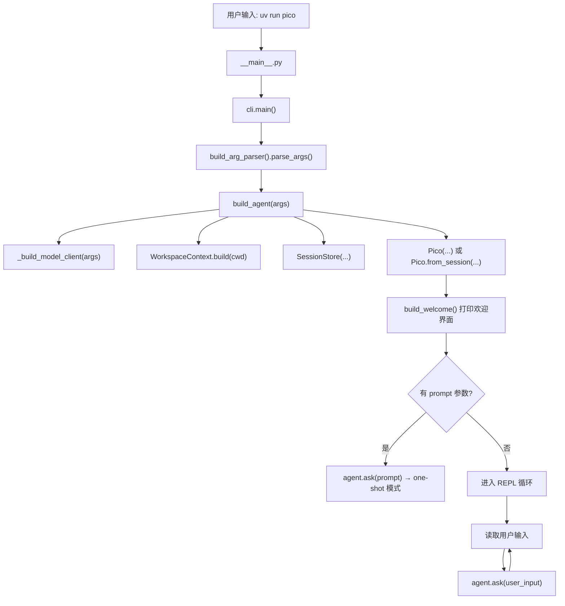
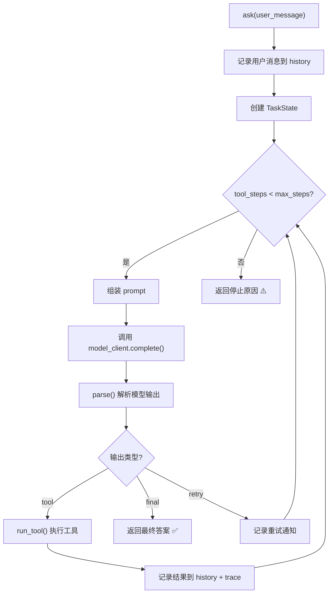

# Pico 

## 项目简介

Pico 是一个**轻量级本地 coding agent**——你可以把它理解为一个"能在你的代码仓库里干活的命令行 AI 助手"。

与普通的 AI 聊天不同，pico 的特点是：
- 🔍 **看得到你的代码**：它会读取仓库的文件结构、Git 状态、最近提交
- 🛠️ **能动手改代码**：它可以读文件、写文件、打补丁、运行 shell 命令
- 🧠 **有记忆**：它会记住读过什么文件、做过什么操作，跨轮对话保持上下文
- 🔒 **有安全边界**：危险操作需要审批，文件操作被限制在仓库内

```
用户输入 → pico 组装 prompt → 调用 LLM → 解析输出 → 执行工具/返回答案
     ↑                                                          |
     └──────────── 循环 直到给出最终答案   ←─────────────────────┘
```

---

## 项目目录

先建立全局视角，知道每个文件"大概是干什么的"：

### 核心文件 `pico/`

| 文件 | 一句话定位 | 重要程度 |
|------|-----------|---------|
| \_\_main\_\_.py | `python -m pico` 的入口，就一行 | ⭐ |
| _\_init\_\_.py | 包的公开 API 列表 | ⭐ |
| cli.py | 命令行解析 + 启动流程 + REPL 交互循环 | ⭐⭐⭐ |
| runtime.py | **核心中的核心**：Agent 主循环、工具执行、prompt 组装 | ⭐⭐⭐⭐⭐ |
| tools.py | 工具定义 + 校验 + 执行函数 | ⭐⭐⭐⭐ |
| models.py | 模型后端适配（ OpenAI / SiliconFlow） | ⭐⭐⭐ |
| workspace.py | 仓库快照：Git 信息 + 项目文档摘要 | ⭐⭐⭐ |
| memory.py | 分层工作记忆系统（短期 + 持久） | ⭐⭐⭐⭐ |
| context_manager.py | Prompt 预算控制：把各段内容塞进有限窗口 | ⭐⭐⭐⭐ |
| task_state.py | 单次请求的状态机（运行中/完成/停止/失败） | ⭐⭐ |
| run_store.py | 运行工件落盘（task_state / trace / report） | ⭐⭐ |
| evaluator.py | 基准测试评估框架 | ⭐⭐ |
| metrics.py | 实验度量：记忆消融、上下文压力、安全场景 | ⭐⭐ |

## 完整链路
> **建议**：带着这条链路去读代码，先读 `cli.py`，再跳到 `runtime.py`。

### 启动链路

**关键理解**：`build_agent()` 是整个启动链路的装配点。它把 CLI 参数翻译成 runtime 需要的对象图。

### 核心循环：`Pico.ask()`



**核心思想**：这是一个典型的 **"感知 → 决策 → 行动 → 记录"** 控制循环。

---

## 功能模块
### 工具系统
Pico 给模型提供了 **8 个基础工具 + 1 个委派工具**：

| 工具 | 作用 | 风险等级 |
|------|------|---------|
| `list_files` | 列出目录内容 | 安全 |
| `read_file` | 按行范围读文件 | 安全 |
| `search` | 用 rg 或回退方案搜索 | 安全 |
| `list_skills` | 列出可用 skills | 安全 |
| `read_skill` | 读取 skill | 安全 |
| `run_shell` | 执行 shell 命令 | ⚠️ 高风险 |
| `write_file` | 写入整个文件 | ⚠️ 高风险 |
| `patch_file` | 精确替换文件中的一段文本 | ⚠️ 高风险 |
| `delegate` | 派生只读子 agent 去调查 | 安全 |

### 记忆系统
```
记忆架构：
┌─────────────────────────────────────┐
│  持久记忆 (Durable Memory)          │  ← .pico/memory/ 目录下的 Markdown
│  项目约定 / 决策 / 依赖 / 偏好       │     跨会话持久化
├─────────────────────────────────────┤
│  情景笔记 (Episodic Notes)          │  ← 最多 12 条，带 tag 和来源
│  读文件摘要 / 工具结果的提纯信息     │     session 级别
├─────────────────────────────────────┤
│  工作记忆 (Working Memory)          │  ← 任务摘要 + 最近 8 个文件
│  当前任务是什么 / 刚碰过哪些文件     │     每轮更新
└─────────────────────────────────────┘
```

**关键机制**：
- **文件摘要带新鲜度校验**：用文件 SHA-256 hash 判断摘要是否过期
- **相关记忆召回**：基于 tag 精确匹配 + 关键词重叠 + 时间新旧排序（不用 embedding）
- **持久记忆晋升**：当用户说"记住"/"保存"等关键词，且模型输出包含 `Project convention:` 等格式时，自动提取并写入 `.pico/memory/`
- **同主题替换**：新笔记如果和旧笔记谈的是同一个主题，会替换而不是堆叠

### 上下文管理
模型的上下文窗口是有限的，这个模块决定**每一段内容分多少预算**：

```
总预算 12000 字符
├── prefix (系统指令 + 工作区) ─────── 3600 字符
├── memory (工作记忆仪表盘) ────────── 1600 字符
├── relevant_memory (相关笔记召回) ── 1200 字符
├── history (对话历史) ────────────── 5200 字符
└── current_request (当前请求) ────── 不限制 ← 永远不裁剪！
```

**当 prompt 超预算时**，按优先级压缩：
1. 先牺牲 `relevant_memory`
2. 再牺牲 `history`
3. 然后动 `memory`
4. 最后才动 `prefix`
5. **`current_request` 永远不压缩**

**历史压缩策略**：
- 最近 6 条保持完整（最多 900 字符/条）
- 更早的条目被压缩到 60 字符
- 重复的 `read_file` 结果会被文件摘要替代
- 旧的 `run_shell` 结果只保留命令和前 3 行输出

### 其他重要功能
#### 工具执行护栏 (`run_tool()`)

工具执行不是直接调函数，而是一条**带护栏的流水线**：

```
工具名是否存在? → 参数是否合法? → 是否重复调用?
  → 是否需要审批? → 执行前快照 → 真正执行 → 执行后快照
  → 对比 diff → 更新记忆
```

#### 安全机制
- **路径逃逸防护**：所有路径必须解析到 workspace root 之下
- **敏感环境变量脱敏**：API_KEY、TOKEN 等自动替换为 `<redacted>`
- **Shell 环境白名单**：只传入安全的环境变量（PATH、HOME 等）
- **审批策略**：`ask`（交互确认）、`auto`（自动通过）、`never`（全部拒绝）
- **重复调用检测**：连续两次相同调用会被拦截

#### Checkpoint 机制
每次工具执行后都会创建 checkpoint，记录：
- 当前目标、卡点、下一步
- 关键文件及其新鲜度 hash
- 运行时身份信息（模型、参数、工作区指纹等）

恢复会话时，pico 会检测 checkpoint 是否过期（文件变了/环境变了）。